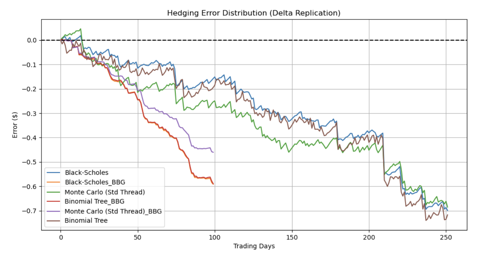

# Option Pricing & Backtesting Engine

A C++17 project for pricing European options and simulating a delta-hedging strategy across historical, synthetic, and Bloomberg-style market data. Python scripts provide data preparation, result visualization, and summary statistics.

## Features

- **Pricing models:** Black–Scholes, a Cox–Ross–Rubinstein binomial tree, and Monte Carlo simulation.
- **Delta hedging:** Rebalances the stock position for each market observation and accrues cash at the supplied risk-free rate.
- **Data sources:** Yahoo Finance (with synthetic fallback), generated synthetic prices, and a Bloomberg-format sample.
- **Analysis:** Exports per-observation hedge results, plots hedging errors, and prints error summary statistics.

## Repository layout

```text
├── data/       Market-data CSV files
├── image/      Images used in project documentation
├── include/    C++ headers
├── logs/       Backtest CSVs, system log, and generated plot
├── scripts/    Python data and analysis utilities
├── src/        C++ pricing, backtesting, and logging implementation
├── Makefile    C++ build rules
└── requirements.txt
```

## Requirements

- A C++17 compiler (the Makefile uses `g++`)
- GNU Make
- Python 3
- Python packages listed in [requirements.txt](requirements.txt)

Install the Python dependencies:

```bash
python3 -m pip install -r requirements.txt
```

## Build and run

Run these commands from the repository root. Data files are already included, so data generation is optional.

```bash
# Optional: fetch/generate the input CSV files
python3 scripts/data_manager.py

# Build the C++ executable
make

# Run the backtests
./OptionEngine

# Generate the hedging-error chart and print summary metrics
python3 scripts/plot_results.py
python3 scripts/final_metrics.py
```

Use `make clean` to remove the executable and compiled object files; `make clean && make` performs a clean rebuild. The data manager attempts to download SPY data from Yahoo Finance. If that request fails or returns no data, it writes synthetic fallback data instead. Running it rewrites the generated CSV files in `data/`.

## Input data

The engine reads rows in positional CSV order after the header:

| Data type | Expected columns | Units |
| --- | --- | --- |
| Standard (Yahoo/synthetic) | `Date,Spot,Rate,Vol` | Rate and volatility are decimals (for example, `0.045` means 4.5%). |
| Bloomberg-style | `DATE,PX_LAST,US_TREASURY_3M,VOLATILITY_30D` | Rate and volatility are percentages (for example, `5.0` means 5%). |

Dates must use `YYYY-MM-DD`. Bloomberg-style values are converted from percentages by the backtester. The included `bloomberg_export.csv` is a generated sample, not a live Bloomberg feed.

## Backtest configuration

The current configuration is set in `src/main.cpp`:

- Option type: European call
- Strike: `100`
- Expiry: `2024-12-30`
- Binomial tree: 100 steps
- Monte Carlo: 5,000 simulations and 252 steps
- Delta hedging: enabled

Edit these values in `src/main.cpp` to change the run. Rebuild with `make` after changing C++ source.

## Outputs

- `logs/result_<model>.csv` contains standard-format backtest results.
- `logs/result_<model>_BBG.csv` contains Bloomberg-format results.
- `logs/hedging_error.png` is created by `scripts/plot_results.py`.
- `scripts/final_metrics.py` prints the mean hedging error, its standard deviation, and maximum absolute deviation for result CSVs.
- `logs/system.log` contains application log messages.

Each result CSV contains `Date`, `Spot`, `T`, `OptionPrice`, `Delta`, `StockPos`, `Cash`, `PortfolioValue`, and `HedgingError` columns.

**Note:** Standard-format runs currently share one output file per pricing model. Since the program processes Yahoo and synthetic data in sequence, the synthetic run overwrites the Yahoo result. Bloomberg-style results use separate `_BBG.csv` files. The checked-in result files may also be overwritten when the backtester is run.

## Performance overview


